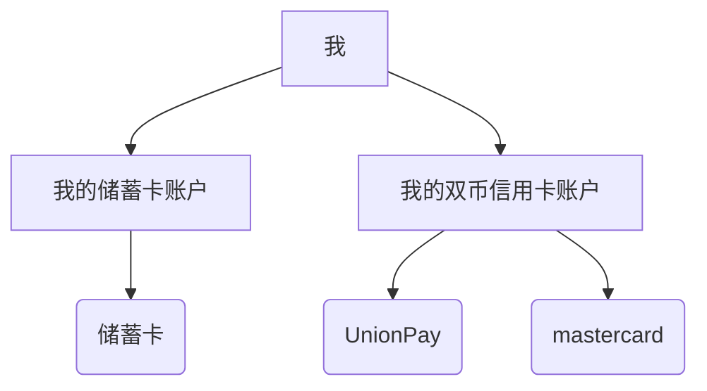
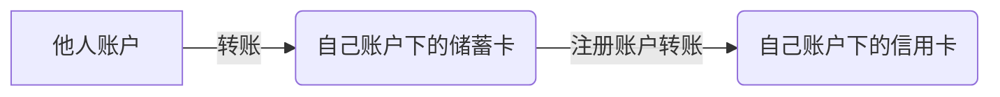
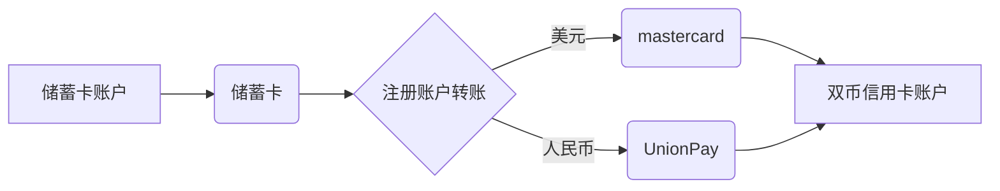

Types of bank cards. How to use them. And some special notes.

Ref: [->Everyday money](https://www.moneyhelper.org.uk/en/everyday-money)

<!--more-->

# Note

本文的信息不一定准确, 详情请咨询银行客服.

由于我主要使用[中国工商银行(ICBC)](https://www.icbc.com.cn/)的银行卡, 因此很多内容只适用于ICBC. 并且由于我拥有一张ICBC的双币零额度信用卡, 本文加入了很多关于它的特殊内容, 这对其他银行和其他类型的信用卡不一定使用.

ICBC的客服电话: 95588

# Debit Card & Credit Card

中国的银行卡业务品种大体分为两类[^1]:

1. **借记卡**: 也称储蓄卡, 是电子卡片化的储蓄存折和存单, 具有消费结算, 转账, 中间业务代理等功能, 但不能透支.
2. 信用卡(包括贷记卡,准贷记卡): 贷记卡是真正意义上的**信用卡**，具有信用消费, 转账结算, 存取现金等功能. 它具有以下特点：**先消费后还款**，享有免息缴款期（最长可达56天），并设有最低还款额，客户出现透支可自主分期还款。准贷记卡很少见, 就不介绍了.

# International Credit Card Organization

国际上六大信用卡组织分别是[VISA](https://baike.baidu.com/item/VISA/60281)、[MasterCard](https://baike.baidu.com/item/MasterCard/53059985)（[万事达卡](https://baike.baidu.com/item/万事达卡/6834979)）、American Express（[美国运通](https://baike.baidu.com/item/美国运通/58473541)）、[UnionPay](https://baike.baidu.com/item/UnionPay/5103957)（[银联](https://baike.baidu.com/item/银联/885296)）、[JCB](https://baike.baidu.com/item/JCB/2324391)和[Diners Club](https://baike.baidu.com/item/Diners Club/6280084)。除银联和JCB外，其余四大信用卡均起源于美国.

虽然每个信用卡组织的卡都支持存储/消费任意币种, 但是**只有收款方指定的卡组织的卡才能用于付款.** 

举个例子, GRE考试报名费用是1720[^2]港币, 必须以visa/mastercard支付. 国内的银行卡虽然也能购买港币, 有港币余额, 但是这张卡不支持visa/mastercard, 所以无法用于付款.

再比如, 在申请美国学校的最后一步是付款, 要求支付几十美元, 并且支持visa/mastercard/jpa. 银联的银行卡可以购买美元, 但这个美元余额也是用不出去的.

在这些场合里想要进行支付, 就**必须开一张支持visa/mastercard/etc..的卡.** 对于出国留学/旅游的人来说, 最方便的就是开通一张双币信用卡, 既可以在国内支付银联, 又可以在国外支付visa等.

当然了, 如果有地方允许用银联支付外币, 那么直接在银联的卡里买外币然后消费即可.

# Credit Card

[->A simple guide to credit cards](https://www.moneyhelper.org.uk/en/everyday-money/types-of-credit/simple-guide-to-credit-cards)

## 双币银行卡

**双币卡是指国内银行发行的一种拥有两个币种结算帐户，即人民币和外币账户，且具有银联和另外一种国际银行卡组织标识的银行卡**。 双币卡在国内通常银联结算网络以人民币为结算货币进行支付，在境外可以使用双币卡标识指定的国际银行卡组织的结算网络以外币为结算货币进行支付。 境外有银联网络的国家也可以使用人民币结算。[^3]

双币银行卡: 拥有两个币种结算账户(UnionPay + visa/mastercard/JCB)的银行卡. 这种卡在物理上是两张卡, 但共享一个账户. **在支持银联的地方, 可以用银联的卡支付; 在支持visa/mastercard/JCB的地方, 就用visa/mastercard/JCB的卡支付, 非常方便.** 

但是, 国内很少有双币的储蓄卡, 也就是说国内的储蓄卡一般都是单银联,不另外支持visa/mastercard/JCB. **双币银行卡一般都是信用卡**. 

学生申请双币银行卡时, 得到的一般都是**零额度的双币信用卡**. 

## 零额度信用卡

信用卡都是先消费后还款. 但国内有些银行会发行**零额度的信用卡**, 这种卡**用起来和借记卡差不多, 需要事先存钱进去才可以刷**.

我拥有一张ICBC的双币零额度的信用卡(贷记卡), 拥有UnionPay和mastercard两张卡面. 这两张卡共享一个账户, 也就是说在UnionPay和mastercard里都能看到人民币和美元余额. 但在支付时**只能用银联卡支付人民币, 只能用mastercard支付美元.**

# Domestic Transfer

这里介绍国内银行卡的转账(transfer)操作.

## Tranfer between Debit Cards

储蓄卡之间的转账很简单, 但有一点值得一提: 中国银行对中国银行可以转美金, 但是只能在以下两种情况下进行转账: 

1. **在中国银行之间双方都是本人名下的账户之间可以进行美金转账**; 
2. 在中国银行直系亲属的账户之间也可以进行美金转账,但是这个需要提供直系亲属证明银行才会予以转账。

## Tranfer between Debit Card and Credit Card

一般来说, 储蓄卡是可以自由地向信用卡转账(还款)的. 但是我手里的这张ICBC双币零额度信用卡比较特殊, **只能用自己账户的储蓄卡转账来进行还款**(由于是零额度的, 无法欠款. 所以这里的"还款"其实等于"充值"). **他人不能直接向自己的信用卡转账.**

**据推测, 其他双币零额度信用卡也是这种情况.** 对于这样的信用卡, 其还款逻辑为: 他人给自己账户的**储蓄卡**转账, 然后由自己账户的储蓄卡通过"注册账户转账"来还款.

注意, **转账的目标卡号根据所转的币种有所区别**. 若所转的是人民币, 则目标信用卡必须是UnionPay. 如果是美元, 则目标信用卡必须是mastercard:

Note: 同账户的一类储蓄卡向二类卡转账不占用转账额度. 但向信用卡转账则可能占用, 我转到我的信用卡就属于这个状况. 为此需要把转账额度提高. 将储蓄卡从自助注册改为柜面注册, 然后就可以修改转账额度了,

# International Transfer

## Why U.S. Account ?

首先要知道, **只使用中国的银行卡就能在美国消费美元**. 例如中国的银行卡都支持UnipnPay(银联), 那么只要是支持UnionPay的支付场合(网页, 商场,Pose机), 都能直接用中国银行卡支付.

但是, UnionPay在美国的普及率还不高, 比如说去Trader Joe's购物就刷不了UnionPay. 此时还有一个方法: 使用中国银行发行的涮双币信用卡. 国内的家人只需要转人民币给留学生, 让ta自己买美元就好了. 

但是美国也有对信用卡不友好的场合, 比如支付房租和学费等等. 以UC(University of California)系统交学费为例, 使用credit card支付需要高达3%的手续费, 因此非常不推荐在这种场合使用credit card. 

此外, 美国的credit card拥有更好的防盗刷机制和消费返现(reward).

对于旅游人士, 没有必要办理美国的银行卡; 对于在美留学生, 推荐先在国内办理一张双币信用卡用于在美国的前几天过渡, 落地后马上办理美国的银行卡(debit card + credit card).

## With U.S. Account

1. 购买外汇. 在自己的手机银行app中搜索外汇, **用debit card购买**即可. 我就使用ICBC(中国工商银行), 在ICBC 手机app中搜索结售汇即可购买美元(注意, 一定要购买"汇", 否则之后无法跨境转账.).
2. **办理一张美国银行卡.** 学生刚来美国办理不了credit card, 只能办理debit card. 推荐在BofA办理checking account的debit card, 当场就能得到电子卡, 并且可以使用Zelle转账.
3. [跨境汇款](https://www.xiaohongshu.com/explore/64df35a9000000000103ea7f)(Note: 跨境汇款的双方银行都会收一笔手续费). 以从ICBC转账到BofA为例,需要在ICBC手机app中使用"跨境汇款", 输入:
   1. 目标银行的SWIFT code(银行国际代码)或者BIC(银行识别码): 这是每个银行机构的唯一标识, 是用于识别银行的编号，类似美国汇款路由编号, 在网上也可查到.
   2. 收款人的account number, 注意不是银行卡号! 在BofA app中即可查到.
   3. 金额, 收款人地址...

你可能想到, 将双币信用卡的美元跨境汇款到美国的debit card就可以避免信用卡手续费. 但是之前提到过, 信用卡是钞户, 而跨境汇款只支持汇, 所以这样做需要支付**钞转汇的手续费**, 高达1.x%. 

Summary: **全都用储蓄卡购汇+跨境汇款.** 双币信用卡中也没必要存太多钱, 因为转出去要付手续费.

### ICBC

上面提到, 每次跨境汇款, 双方银行都要收一次手续费. ICBC是40 CNY/次, 而BofA是15 USD/次, 换算下来, 每次都要花150 CNY. 

有一个不用付手续费的跨境付款方式: ([->ref](https://www.xiaohongshu.com/explore/6314b4a4000000001303acf0))

1. 开一张国内ICBC的debit card.
2. 开一张ICBC美国分行的debit card. [->ICBC美国分行的地址]([各个分行的地址](https://www.icbc-us.com/cn/page/721852441816760361.html). )
3. 国内的账户先给美国的工行转(美元), 然后从美国工行转美国其它银行. 全程不需要手续费. 
   * 在支持ICBC的ATM上对ICBC美国银行卡进行提现也不需要手续费. 

> Q: 既然有了ICBC美国分行的debit card, 那么在美国就可以正常消费了, 为什么还要转账到美国其他银行?
>
> A: 这是因为美国银行卡普遍有各种活动, 返现, 而ICBC没有. 所以用美国银行卡可以有更多优惠.

# Withdraw Cash

银行卡在ATM取现[^5], 需要付两笔手续费:

1. ATM机的网络: Out-of-Network Fee. 当你在非发卡行的网络上使用你的 ATM 卡时，就有可能被收取这笔费用。比如下图是 Chase Total Checking 的费用条款。在美国非 Chase ATM 上的操作每次都需要 \$2.5，美国之外的 ATM 取现每次甚至要 \$5。

   

2. ATM运营商Operator Surcharge. 除了  发卡行，运营 ATM 机的机构也可以额外收你钱。比较“有名”的是 Las Vegas 那些赌场，单次 ATM surcharge 甚至能接近 \$10（参考 Las Vegas Then and Now 的[这篇文章](https://lasvegasthenandnow.com/where-to-find-the-cheapest-atms-on-the-las-vegas-strip/)）。感谢读者 [mysteryjoe](http://disq.us/p/2jeycaj) 提醒。

   这两类 fee 是叠加的！比如我在 Las Vegas 那些赌场用 Chase Total Checking 的卡取现 $100，我要给 Chase 交 $2.5 Non-Chase ATM Fee，同时还要给 ATM operator 交最多 \$ 10 的钱，一下子我就要被扣走最多 \$ 12.5，太坑了！

如果你在美国之外使用你的 debit card，也可能会遇到 Foreign Transaction Fee (FTF)，这种 fee 一般有两类：

- 刷卡消费：往往有 3% 的 FTF，根据你的刷卡金额来决定。
- 取现：和上面的 out-of-network fee 类似，单次收取一定金额。不过境外的 out-of-network fee 往往比境内的更贵。

如果你取外币，有的银行甚至会收取你 3% FTF + out-of-network fee, 这就太不划算了.

## For Credit Card

信用卡取现有两种方式:

1. Cash Advance(CA): 就是从银行柜台办理的信用卡取现, 手续费由发卡行设定, 一般**很高**. 以ICBC为例, cash advance的手续费是取现金额的2.9%. 最低3美元, 最高50美元. 除非无奈, 否则不要选择这种方式.

   Note: Cash Advance的手续费只和发卡行有关, 和Mastercard等信用卡组织无关.

   > What is the fee for withdrawing money from the ATM? For cash advance?
   >
   > **ATM fees are not determined by MasterCard.** Any ATM fees charged by the ATM owner are disclosed at the time the transaction is initiated. Cardholders are given the option to discontinue the transaction if they do not wish to pay these fees. Additionally, be sure to check with the financial institution/bank that issued your card to determine their ATM fee policies. You will find their contact information on the back of your MasterCard card and/or on your billing statement. Or you can visit the issuer's Web site to manage your account online.

2. ATM 取现: 除了Out-of-Network Fee和Operator Surcharge外, 发卡行也会收费, 价格比较低廉. 以ICBC为例, 跨境ATM机取现的费用是外币面值1%的CNY + 12 CNY, 最高是112 CNY. 也就是说取100 USD, 手续费为1 + 12 CNY; 同理, 取10000 USD, 手续费达到最高值, 为112 CNY.

   * 有人说信用卡只要是在ATM取现, 就算作CA. 但我问了BofA的工作人员, 从它们的ATM取现是不算CA的.

## How to Avoid Fee

首先, 尽量使用Debit Card取现, 不要用Credit Card. 

其次, Out-of-Network Fee和Operator Surcharge都可以通过使用发卡行的ATM机所避免. 比如你办了 Chase 的卡, 那么就只在 Chase ATM 上取现. 所以要办什么银行的账户, 与你生活和常去的地方有哪些银行关系很大.

有时候银行也会拓展自己的 ATM network, 在一些不是自己 branch 里的 ATM 机上也可以免费取现, 比如 Citibank Debit Card 在美国的 Target, Walmart, CVS 等店里的 ATM 上就可以免费使用. 这些信息可以查询自己的发卡行得知.

以ICBC U.S.( 工银美国)[^6] 为例, 工银美国已经加入MoneyPass的免取款费ATM网络, 带有MoneyPass标识的ATM机 (美国境内超过37,000台）对工银美国借记卡持卡人均免收ATM取款费.

* [Find a MoneyPass® ATM.](https://www.moneypass.com/atm-locator.html)

## Limit

首先, 根据中国的外汇管制[^7], 每人账户下所有卡的跨境取现额度是10k rmb/day, 100k rmb/mon, 违规的后果比较严重:

> 通知规定，个人持境内银行卡在境外提取现金，本人名下银行卡（含附属卡）合计每个自然年度不得超过等值10万元人民币；人民币卡、外币卡境外提取现金每卡每日额度统一为等值1万元人民币；个人持境内银行卡境外提取现金超过年度额度的，本年及次年将被暂停持境内银行卡在境外提取现金。

此外, 发卡行本身也会对卡有限制. 以ICBC为例[^8]:

> 您可持本人卡片和有效身份证件或取现密码，在工商银行营业网点、有工商银行或“银联” 标识的ATM取现。双币贷记卡还可在境外有关信用卡组织或公司（“威士” 、“万事达卡” 、“运通” 、“JCB” 或“大来” ）的ATM和银行网点提取当地货币。
>
> 双币贷记卡在境外有关信用卡组织或公司（“威士”、“万事达卡”、“运通”、“JCB”或“大来”）的ATM机或银行网点取现，根据国家外汇管理局规定，当日内累计不得超过等值1000美元，一个月内累计取现不得超过等值5000美元，6个月内累计取现不得超过等值10000美元。

* [->Find MasterCard ATM](https://m.icbc.com.cn/ICBC/%E5%A4%96%E9%83%A8%E8%B0%83%E7%94%A8/%E5%B7%A5%E9%93%B6%E7%8E%AF%E7%90%83%E9%80%9A/%E5%A2%83%E5%A4%96%E5%8F%96%E7%8E%B0.htm)

似乎除ICBC分行外, 直接联系Mastercard也行/Mastercard的[ATM](https://www.mastercard.us/en-us/personal/get-support/find-nearest-atm.html)离这里挺近的, 不像ICBC的分行都在SF. 就是不知道可不可行.

我明天试试, 多打打电话吧.

## Apply for A U.S. Account

首先, 建议留学生来美国前先在国内办好双币信用卡, 并充值一些美元. 这样就可以在美国于mastercard/visa等场合支付. 

要办理美国银行卡, 建议留学生先带1~2k USD现金到美国, 一方面是以备不时之需, 另一方面是办好银行卡可以直接存进去. 当然你也可以办卡后再让家人跨境汇款.

顺便说一句, 前往美国时携带的现金总价值最好小于等于10k USD. 超过这个数额就要申报:

> From: [How much currency/monetary instruments can I bring into the United States?](https://help.cbp.gov/s/article/Article-195?language=en_US)
>
> It is legal to transport any amount of currency or other monetary instruments into or out of the United States. **However, if you transport, attempt to transport, or cause to be transported (including by mail or other means) currency or other monetary instruments in a combined amount exceeding \$10,000 (or its foreign equivalent) at one time from the United States to any foreign country or into the United States from any foreign country, you must file a FinCEN Form 105** (“Report of International Transportation of Currency or Monetary Instruments”) with U.S. Customs and Border Protection. You may file in paper form or file electronically at FinCEN Form 105 CMIR, U.S. Customs and Border Protection (dhs.gov). International travelers entering the United States must declare if they are carrying currency or monetary instruments in a combined amount over $10,000 on their Customs Declaration Form (CBP Form 6059B) and then file a FinCEN Form 105.

# Foreign Exchange Purchasing

以工商银行为例, 在手机银行app的"结售汇"中即可购买美元. 无论储蓄卡, 信用卡还是双币信用卡, 都可以购买美元. 但如前所述, 只有被支持的银行组织的卡才可以消费美元. 

此外, 外汇还会有"钞(cash)"和"汇(exchange)"的区别. TL;DR: 总是选择汇, 不要用钞.

## Cash & Exchange

[现钞(cash)和现汇(exchange)的区别](https://www.uscreditcardguide.com/foreigner-currency-chao-and-hui/)

外币(foreign concurrency)有[汇和钞的区别](https://www.icbc.com.cn/icbc/%E5%AE%A2%E6%88%B7%E6%9C%8D%E5%8A%A1/%E7%83%AD%E7%82%B9%E9%97%AE%E7%AD%94/%E6%8A%95%E8%B5%84%E7%90%86%E8%B4%A2/%E5%A4%96%E6%B1%87%E7%8E%B0%E9%92%9E%E4%B8%8E%E7%8E%B0%E6%B1%87%E6%9C%89%E4%BD%95%E5%8C%BA%E5%88%AB.htm). 简单地说, **总是选择购买"汇".** 汇可以完全替代钞, 但钞不能替代汇.

* “现汇”指国际金融市场上可自由买卖, 在国际上得到偿付并可以自由兑换其他国家货币的外汇.
* “现钞”是指外币现金或以外币现金存入银行的款项.

* 钞的缺点:
  1. **不能转账到别人账户**, 只能在自己账户的卡之间转账.
  2. **不能跨境转账**. 跨境转账只可以用"汇".
  3. 钞转汇需要一笔**手续费**, 大概在1%左右(100 USD的钞转汇需要支付7.x CNY手续费).
* 钞的优点: **完全没有**. 购买"钞"之后可以直接提取现金(例如100 USD的钞可以提现100 USD), 但是"汇"也可以. 当然了, 只要是支持以"钞"支付的场合, 那用钞也是没问题的.(比如说拿着双币信用卡去外国消费, 外国收款都是mastercard/visa, 不在乎你支出的是钞还是汇.)

* [**信用卡是钞户, 不是汇户**](https://www.xiaohongshu.com/explore/62491a60000000002103f4ad). 信用卡可以存储钞和汇, 但转出时会全部转换成钞. 在ICBC结售汇的页面, 如果用debit card购汇, 出现的选项有"钞"和"汇"; 但如果用credit card购汇, 则只能选择"钞". **因此购买美元一定要用debit card而不是credit card, 并选择购买"汇".**

* 此外, **跨境转账只能够使用debit card, 不能用credit card; 且只能转"汇", 不能转"钞".** 因此credit card中的美元("钞")是无法直接进行跨境转账的, 唯一的方式就是把它转账到debit card, 由后者进行跨境转账, 但这就要支付钞转汇手续费了.

* Best Practice:

  https://www.xiaohongshu.com/explore/6456dcd60000000013031429:

  > 如果你在美国留学，然后想去欧洲旅游。你有工商银行的信用卡的话，你趁汇率好的时候提前买下了欧元的现汇在储蓄卡里。这个时候你想花掉这笔钱。就尽量先在储蓄卡里头，以现汇的形式。等你用信用卡消费了之后，你在用储蓄卡里的欧元现汇去还信用卡欠下的欧元现钞。不建议一股脑的把所有的储蓄卡里存的现汇都转到信用卡里，因为如果你用不完的话，你从信用卡再转到储蓄卡里的话会换成现钞，因为信用卡是钞户不是汇户。从储蓄卡转现汇到信用卡里是不用手续费的。信用卡可以接收现汇，也可以接收现钞，但是信用卡转出的话只能转出现钞，就是这个意思。

## CNY -> USD

对于结售汇, 中国规定了每人每年的"便利结售汇额度"[^4]: 境内个人享有年度购汇和结汇便利化额度，境外个人享有年度结汇便利化额度，分别为每人每年等值**5万美元. 也就是说每人每年最多买5万美元的外汇, 这个额度是一个人在中国所有银行的账户间共享的.**

这50k USD只是通过手机银行app购汇的额度, 而在柜台办理的结售汇不受此额度限制.

除了每年的便利购汇额度, 部分卡还会有额外限制. 比如我的ICBC双币零额度信用卡就还拥有"日累计转收金额"的限制, 相当于每天的结售汇都有额度.

对于留学生而言, 一年花销超过50k USD很正常, 此时可以多叫几个亲戚来购汇(一人50k USD, 父母两人就是100k USD, 足够花一年了), 或者让父母去线下购汇.

## USD -> CNY

当你在美国发了大财, 想要孝敬国内的父母的时候, 就需要把美元换成人民币了. 由于跨境转账总是要手续费, 最好的方式就是转钱到美国的ICBC, 然后再转回国内, 不仅不需要手续费, 而且速度快.

# Transfer Methods

在中国银行之间, 美国银行之间的转账不讲了, 这类转账一般不收或者只收低廉的手续费. 本章介绍如何**跨境汇款**, 也就是从中国银行转账到美国银行.

# Payment Methods

[之前](#transfer-methods)已经介绍了如何向美国银行卡账户充值(美元), 本章介绍如何使用银行卡账户进行支付. 

对于中国人来说, 什么都可以用支付宝和wechat支付, 非常便捷. 但美国的电子支付并没有这么发达, 常见的支付方式有:

1. Zelle等手机支付app: 和支付宝一样, 但并不是所有场合支持.
2. Credit Card转账: 和储蓄卡的区别在于有些地方用信用卡支付需要付一笔昂贵的手续费. 
3. Credit Card刷卡: 商场购物之类的会支持, 也不需要手续费. 但交学费房租等场合没法线下刷卡.
4. Wire Transfer(也就是Debit Card转账): 也就是电子银行转账. Note: wire transfer本身也可能收一笔**手续费(大概100-200 CNY)**.
5. Check: 支票, 美国常用, 不讲了.
6. E-Check: 本质上属于ACH, wire transfer的区别在于**不收手续费**. 不过要等2-3天到账.

学费, 房租支付很多是不支持Zelle和信用卡刷卡的, 那么就剩下三种方式:

1. Credit Card转账, 手续费很高, 不推荐.
2. Wire Transfer: 可能会有手续费.
3. E-Check: **不收手续费**.

因此最好的支付方法就是**E-Check**. 

## E-Check

打开学校的支付页面, 选择eCheck, 然后输入routing number和account numbee即可. 

routing number只与所在州有关, google就能搜到.

> 在BofA手机app中, 点击存款余额, 点击 Account & Routing#, 即可看到Accpunt Number和Routing Number. 注意, 由于我们用的是eCheck而不是纸质支票, 所以routing number要选择Paper & Electronic.

# For International Students(US)

这里介绍去美国的中国留学生如何使用银行卡.

> 

最后, 来美国后马上办理美国银行的银行卡. 有两个原因:

1. 双币信用卡只支持一种国外银行组织, 不适用于所有场合. 比如我的卡是mastercard, 但支付房租需要用visa.
2. 美国的credit card一般会给一些reward, 用起来能比国内的卡省不少钱.

推荐的银行是[BOA](https://www.bankofamerica.com/), 可以同时办理办理debit card和credit card.

## Shopping

Amazon也支持CNY结算, 但是要收所谓的[汇率转换费](https://www.dealmoon.com/guide/893405), 最后还不如美元结算.

Amazon: 1 USD = 7.28033 CNY

ICBC: 7.2869

Amazon购买20.94 USD的物品, 按照Amazon的汇率算: 

20.94 * 7.28033 = 152.45011 CNY

加上汇率转换费3.43 CNY:

152.45011  + 3.43 = 155.88011 CNY

如果直接用ICBC购买的美元结算:

20.94 * 7.2869 = 152.587686 CNY.

得出结论: 用ICBC购买美元然后付款美元.

[^1]: [分清楚借记卡和信用卡](http://www.ccb.com/cn/ebank/20120601_1338540566.html)
[^2]: [GRE® General Test at home Voucher Fee: HK$ 1,720](https://mip.hkeaa.edu.hk/mip/gre/register/139/form)
[^3]: [双币卡](https://baike.baidu.com/item/%E5%8F%8C%E5%B8%81%E5%8D%A1/3677986#:~:text=%E5%8F%8C%E5%B8%81%E5%8D%A1%E6%98%AF%E6%8C%87,%E4%B9%9F%E5%8F%AF%E4%BB%A5%E4%BD%BF%E7%94%A8%E4%BA%BA%E6%B0%91%E5%B8%81%E7%BB%93%E7%AE%97%E3%80%82)
[^4]: [个人年度便利化额度是多少？](https://www.dahsing.com.cn/portal/zh_CN/zxzxxx/20210430/2245.html#:~:text=%E5%A2%83%E5%86%85%E4%B8%AA%E4%BA%BA%E4%BA%AB%E6%9C%89%E5%B9%B4%E5%BA%A6%E8%B4%AD,%E6%96%B0%E7%9A%84%E4%BE%BF%E5%88%A9%E5%8C%96%E9%A2%9D%E5%BA%A6%E3%80%82)
[^5]: [ATM 取现手续费科普](https://www.uscreditcardguide.com/bank-atm-fees/)
[^6]: [ 工银美国 ATM和网点](https://icbc-us.com/cn/column/1438058489762431131.html)
[^7]: [银行卡境外取现每年不得超过十万元](https://www.gov.cn/xinwen/2017-12/31/content_5251899.htm#:~:text=%E9%80%9A%E7%9F%A5%E8%A7%84%E5%AE%9A%EF%BC%8C%E4%B8%AA%E4%BA%BA%E6%8C%81%E5%A2%83%E5%86%85,%E5%8D%A1%E5%9C%A8%E5%A2%83%E5%A4%96%E6%8F%90%E5%8F%96%E7%8E%B0%E9%87%91%E3%80%82)
[^8]: [ICBC 信用卡跨境取现](https://m.icbc.com.cn/ICBC/%E5%A4%96%E9%83%A8%E8%B0%83%E7%94%A8/%E5%B7%A5%E9%93%B6%E7%8E%AF%E7%90%83%E9%80%9A/%E5%A2%83%E5%A4%96%E5%8F%96%E7%8E%B0.htm)
