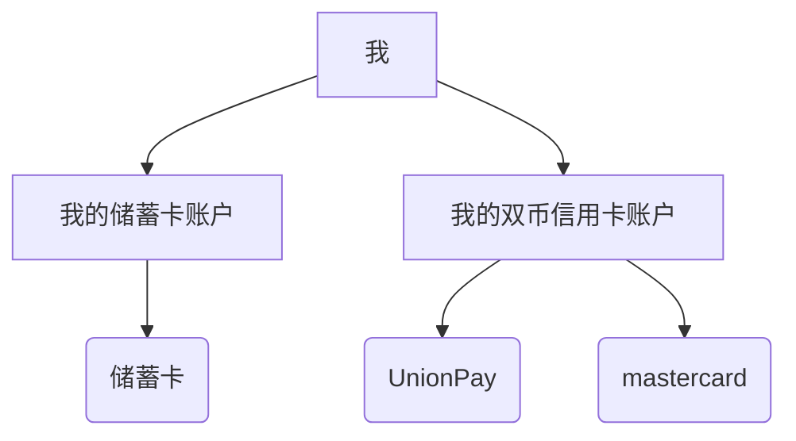
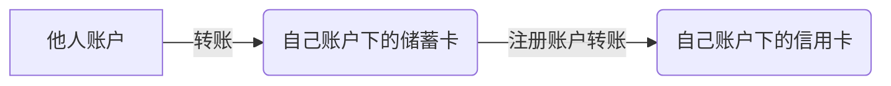
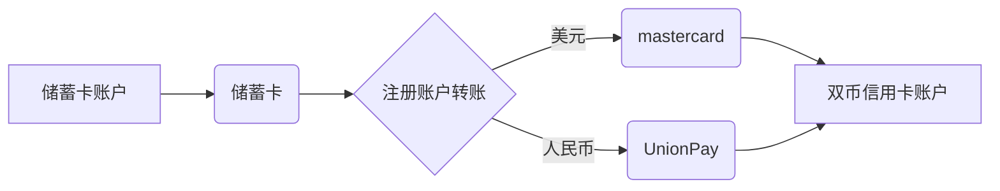

Types of bank cards. How to use them. And some special notes.

Ref: [->Everyday money](https://www.moneyhelper.org.uk/en/everyday-money)

<!--more-->

# Note

本文的信息不一定准确, 详情请咨询银行客服.

由于我主要使用[中国工商银行(ICBC)](https://www.icbc.com.cn/)的银行卡, 因此很多内容只适用于ICBC. 并且由于我拥有一张ICBC的双币零额度信用卡, 本文加入了很多关于它的特殊内容, 这对其他银行和其他类型的信用卡不一定使用.

ICBC的客服电话: 95588

# Debit Card & Credit Card

中国的银行卡业务品种大体分为两类[^1]:

1. **借记卡**: 也称储蓄卡, 是电子卡片化的储蓄存折和存单, 具有消费结算, 转账, 中间业务代理等功能, 但不能透支.
2. 信用卡(包括贷记卡,准贷记卡): 贷记卡是真正意义上的**信用卡**，具有信用消费, 转账结算, 存取现金等功能. 它具有以下特点：**先消费后还款**，享有免息缴款期（最长可达56天），并设有最低还款额，客户出现透支可自主分期还款。准贷记卡很少见, 就不介绍了.

# International Credit Card Organization

国际上六大信用卡组织分别是[VISA](https://baike.baidu.com/item/VISA/60281)、[MasterCard](https://baike.baidu.com/item/MasterCard/53059985)（[万事达卡](https://baike.baidu.com/item/万事达卡/6834979)）、American Express（[美国运通](https://baike.baidu.com/item/美国运通/58473541)）、[UnionPay](https://baike.baidu.com/item/UnionPay/5103957)（[银联](https://baike.baidu.com/item/银联/885296)）、[JCB](https://baike.baidu.com/item/JCB/2324391)和[Diners Club](https://baike.baidu.com/item/Diners Club/6280084)。除银联和JCB外，其余四大信用卡均起源于美国.

虽然每个信用卡组织的卡都支持存储/消费任意币种, 但是**只有收款方指定的卡组织的卡才能用于付款.** 

举个例子, GRE考试报名费用是1720[^2]港币, 必须以visa/mastercard支付. 国内的银行卡虽然也能购买港币, 有港币余额, 但是这张卡不支持visa/mastercard, 所以无法用于付款.

再比如, 在申请美国学校的最后一步是付款, 要求支付几十美元, 并且支持visa/mastercard/jpa. 银联的银行卡可以购买美元, 但这个美元余额也是用不出去的.

在这些场合里想要进行支付, 就**必须开一张支持visa/mastercard/etc..的卡.** 对于出国留学/旅游的人来说, 最方便的就是开通一张双币信用卡, 既可以在国内支付银联, 又可以在国外支付visa等.

当然了, 如果有地方允许用银联支付外币, 那么直接在银联的卡里买外币然后消费即可.

# Credit Card

[->A simple guide to credit cards](https://www.moneyhelper.org.uk/en/everyday-money/types-of-credit/simple-guide-to-credit-cards)

## 双币银行卡

**双币卡是指国内银行发行的一种拥有两个币种结算帐户，即人民币和外币账户，且具有银联和另外一种国际银行卡组织标识的银行卡**。 双币卡在国内通常银联结算网络以人民币为结算货币进行支付，在境外可以使用双币卡标识指定的国际银行卡组织的结算网络以外币为结算货币进行支付。 境外有银联网络的国家也可以使用人民币结算。[^3]

双币银行卡: 拥有两个币种结算账户(UnionPay + visa/mastercard/JCB)的银行卡. 这种卡在物理上是两张卡, 但共享一个账户. **在支持银联的地方, 可以用银联的卡支付; 在支持visa/mastercard/JCB的地方, 就用visa/mastercard/JCB的卡支付, 非常方便.** 

但是, 国内很少有双币的储蓄卡, 也就是说国内的储蓄卡一般都是单银联,不另外支持visa/mastercard/JCB. **双币银行卡一般都是信用卡**. 

学生申请双币银行卡时, 得到的一般都是**零额度的双币信用卡**. 

## 零额度信用卡

信用卡都是先消费后还款. 但国内有些银行会发行**零额度的信用卡**, 这种卡**用起来和借记卡差不多, 需要事先存钱进去才可以刷**.

我拥有一张ICBC的双币零额度的信用卡(贷记卡), 拥有UnionPay和mastercard两张卡面. 这两张卡共享一个账户, 也就是说在UnionPay和mastercard里都能看到人民币和美元余额. 但在支付时**只能用银联卡支付人民币, 只能用mastercard支付美元.**

# Transfer

这里介绍银行卡的转账(transfer)操作.

## Tranfer between Debit Cards

储蓄卡之间的转账很简单, 但有一点值得一提: 中国银行对中国银行可以转美金, 但是只能在以下两种情况下进行转账: 

1. **在中国银行之间双方都是本人名下的账户之间可以进行美金转账**; 
2. 在中国银行直系亲属的账户之间也可以进行美金转账,但是这个需要提供直系亲属证明银行才会予以转账。

## Tranfer between Debit Card and Credit Card

一般来说, 储蓄卡是可以自由地向信用卡转账(还款)的. 但是我手里的这张ICBC双币零额度信用卡比较特殊, **只能用自己账户的储蓄卡转账来进行还款**(由于是零额度的, 无法欠款. 所以这里的"还款"其实等于"充值"). **他人不能直接向自己的信用卡转账.**

**据推测, 其他双币零额度信用卡也是这种情况.** 对于这样的信用卡, 其还款逻辑为: 他人给自己账户的**储蓄卡**转账, 然后由自己账户的储蓄卡通过"注册账户转账"来还款.

注意, **转账的目标卡号根据所转的币种有所区别**. 若所转的是人民币, 则目标信用卡必须是UnionPay. 如果是美元, 则目标信用卡必须是mastercard:

# Foreign Exchange Purchasing

以工商银行为例, 在手机银行app的"结售汇"中即可购买美元. 无论储蓄卡, 信用卡还是双币信用卡, 都可以购买美元. 但如前所述, 只有被支持的银行组织的卡才可以消费美元. 

外汇有[汇和钞的区别](https://www.icbc.com.cn/icbc/%E5%AE%A2%E6%88%B7%E6%9C%8D%E5%8A%A1/%E7%83%AD%E7%82%B9%E9%97%AE%E7%AD%94/%E6%8A%95%E8%B5%84%E7%90%86%E8%B4%A2/%E5%A4%96%E6%B1%87%E7%8E%B0%E9%92%9E%E4%B8%8E%E7%8E%B0%E6%B1%87%E6%9C%89%E4%BD%95%E5%8C%BA%E5%88%AB.htm). 简单地说, 除非在将来要把买到的美元换成现金, 否则**总是选择购买"汇".**

在购买美元(汇)后, 无论是直接消费还是提取美元现金, 都是按照汇率计算的, 不会亏钱. 

在购买美元(钞)后, 再把它重新卖掉变成人民币, 也不会亏钱.

但把美元(汇)换成人民币就会亏损.

在转账时也要注意转的是"汇"还是"钞".

## CNY -> USD

对于结售汇, 中国规定了每人每年的"便利结售汇额度"[^4]: 境内个人享有年度购汇和结汇便利化额度，境外个人享有年度结汇便利化额度，分别为每人每年等值**5万美元. 也就是说每人每年最多买5万美元的外汇, 这个额度是一个人在中国所有银行的账户间共享的.**

这50k USD只是通过手机银行app购汇的额度, 而在柜台办理的结售汇不受此额度限制.

除了每年的便利购汇额度, 部分卡还会有额外限制. 比如我的ICBC双币零额度信用卡就还拥有"日累计转收金额"的限制, 相当于每天的结售汇都有额度.

对于留学生而言, 一年花销超过50k USD很正常, 此时可以多叫几个亲戚来购汇(一人50k USD, 父母两人就是100k USD, 足够花一年了), 或者让父母去线下购汇.

## USD -> CNY

当你在美国发了大财, 想要孝敬国内的父母的时候, 就需要把美元换成人民币了. 由于跨境转账总是要手续费, 最好的方式就是转钱到美国的ICBC, 然后再转回国内, 不仅不需要手续费, 而且速度快.

# For International Students(US)

这里介绍去美国的中国留学生如何使用银行卡.

首先, 建议留学生带1~2k USD现金到美国, 以备不时之需. 因为美国不同于中国, 线上支付没有那么发达, 还是有很多需要用现金的地方的. 顺便说一句, 前往美国时携带的现金总价值最好小于等于10k USD. 超过这个数额就要申报了.

> From: [How much currency/monetary instruments can I bring into the United States?](https://help.cbp.gov/s/article/Article-195?language=en_US)
>
> It is legal to transport any amount of currency or other monetary instruments into or out of the United States. **However, if you transport, attempt to transport, or cause to be transported (including by mail or other means) currency or other monetary instruments in a combined amount exceeding \$10,000 (or its foreign equivalent) at one time from the United States to any foreign country or into the United States from any foreign country, you must file a FinCEN Form 105** (“Report of International Transportation of Currency or Monetary Instruments”) with U.S. Customs and Border Protection. You may file in paper form or file electronically at FinCEN Form 105 CMIR, U.S. Customs and Border Protection (dhs.gov). International travelers entering the United States must declare if they are carrying currency or monetary instruments in a combined amount over $10,000 on their Customs Declaration Form (CBP Form 6059B) and then file a FinCEN Form 105.

其次, 建议留学生来美国前先在国内办好双币信用卡, 并充值一些美元. 这样就可以在美国于mastercard/visa等场合支付. 

最后, 来美国后马上办理美国银行的银行卡. 有两个原因:

1. 双币信用卡只支持一种国外银行组织, 不适用于所有场合. 比如我的卡是mastercard, 但支付房租需要用visa.
2. 美国的credit card一般会给一些reward, 用起来能比国内的卡省不少钱.

推荐的银行是[BOA](https://www.bankofamerica.com/), 可以同时办理办理debit card和credit card.

## CN -> US

从国内的银行卡给留学生转账有两个方法:

1. 留学生自己使用双币信用卡, 因此国内的家人只需要转人民币给留学生, 让ta自己买美元就好了.
2. 留学生使用美国的银行卡. 此时只能通过跨境汇款的方法. 国内银行卡(储蓄卡或者双币信用卡)需要先购买美元, 然后把美元汇给美国银行卡. 但是跨境汇款会收一笔手续费.

[^1]: [分清楚借记卡和信用卡](http://www.ccb.com/cn/ebank/20120601_1338540566.html)
[^2]: [GRE® General Test at home Voucher Fee: HK$ 1,720](https://mip.hkeaa.edu.hk/mip/gre/register/139/form)
[^3]: [双币卡](https://baike.baidu.com/item/%E5%8F%8C%E5%B8%81%E5%8D%A1/3677986#:~:text=%E5%8F%8C%E5%B8%81%E5%8D%A1%E6%98%AF%E6%8C%87,%E4%B9%9F%E5%8F%AF%E4%BB%A5%E4%BD%BF%E7%94%A8%E4%BA%BA%E6%B0%91%E5%B8%81%E7%BB%93%E7%AE%97%E3%80%82)
[^4]: [个人年度便利化额度是多少？](https://www.dahsing.com.cn/portal/zh_CN/zxzxxx/20210430/2245.html#:~:text=%E5%A2%83%E5%86%85%E4%B8%AA%E4%BA%BA%E4%BA%AB%E6%9C%89%E5%B9%B4%E5%BA%A6%E8%B4%AD,%E6%96%B0%E7%9A%84%E4%BE%BF%E5%88%A9%E5%8C%96%E9%A2%9D%E5%BA%A6%E3%80%82)
