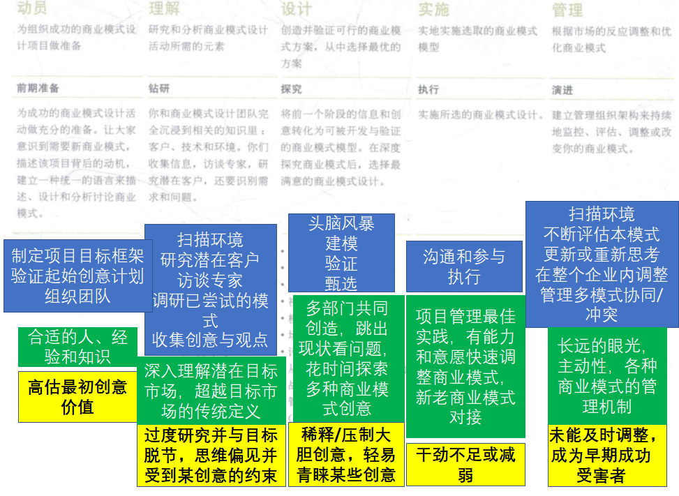

Outline:

* 设计目标
* 五个步骤

<!--more-->

## 设计目标

### 商业模式设计与创新

+ 满足市场：满足尚未被响应的、被忽视的市场需求；
+ 投放市场：把新的技术、产品或服务推向市场，或利用现有的知识产权；
+ 改善市场：通过一个更好的商业模式来改进、颠覆或变革现有的市场；
+ 创造市场：创造一种全新的市场，提供一种全新的业务。

#### 挑战

+ 找到正确的模式

+ 全面启动前展开验证

+ 诱导市场接受新模式

+ 根据市场反馈不断调整

+ 管理不确定因素

### 成熟组织特有的因素

+ 反应性：现行模式遇到了危机，如濒临破产的局面等；
+ 适应性：为了调整、改善和稳固现行的模式，以适应不断变化的环境；
+ 扩张性：为了把新的技术、产品或服务推向市场；
+ 积极性/探索性：为了探索和测试未来的可能的全新模式，为未来做准备。

#### 挑战

+ 为新模式培育市场
+ 磨合新旧两种模式
+ 管理好既得利益
+ 着眼于长远

## 五个步骤

### 概述

<!---->

### 注意事项

+ 动员
  + 项目合法性、管理既得利益、跨职能团队、引导决策者

+ 理解
  + 绘制并评估当前商业模式、跳出现状看问题、不要局限于当前的客户群体、展示进展

+ 设计
  + 避免对大胆想法的遏制、参与式设计、思考新旧模式之间的关系、避免聚焦短期利益

+ 实施
  + 主动管理“路障”、项目赞助人、新旧商业模式之间的关系、内部沟通活动

+ 管理
  + 商业模式管理机制、管理协同和冲突、商业模式组合、空杯心态

